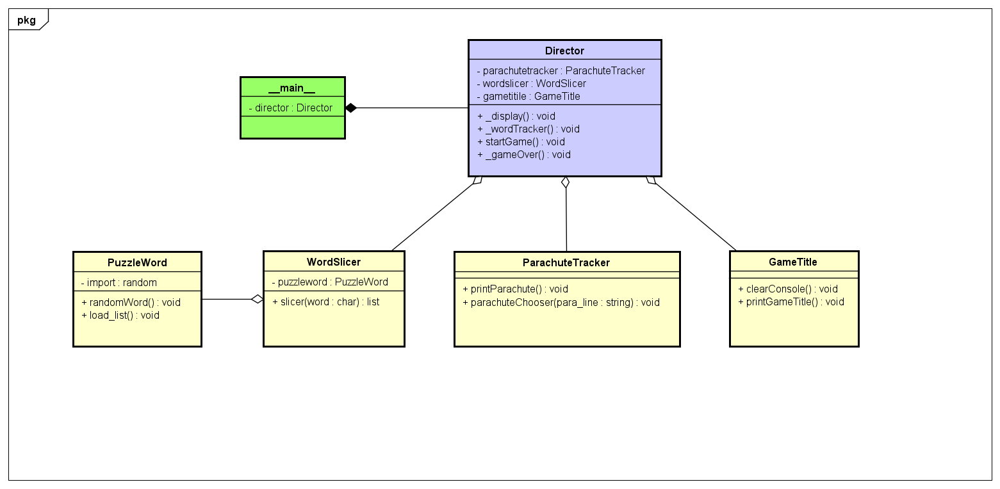

# Jumper Specification

## Overview

Jumper is a game in which the player seeks to solve a puzzle by guessing the letters of a secret word one at a time.

## Get Started

To run the program you need to execute on console or terminal the following command `#python3 jumper`.

## Game Rules

Jumper is played according to the following rules.

- The puzzle is a secret word randomly chosen from a list.
- The player guesses a letter in the puzzle.
- If the guess is correct, the letter is revealed.
- If the guess is incorrect, a line is cut on the player's parachute.
- If the puzzle is solved the game is over.
- If the player has no more parachute the game is over.

## Game Design

This will will the design of our game

## Team Members

- Ronilo Gulay
- Giovanni Bonfim
- Alan Montoya
